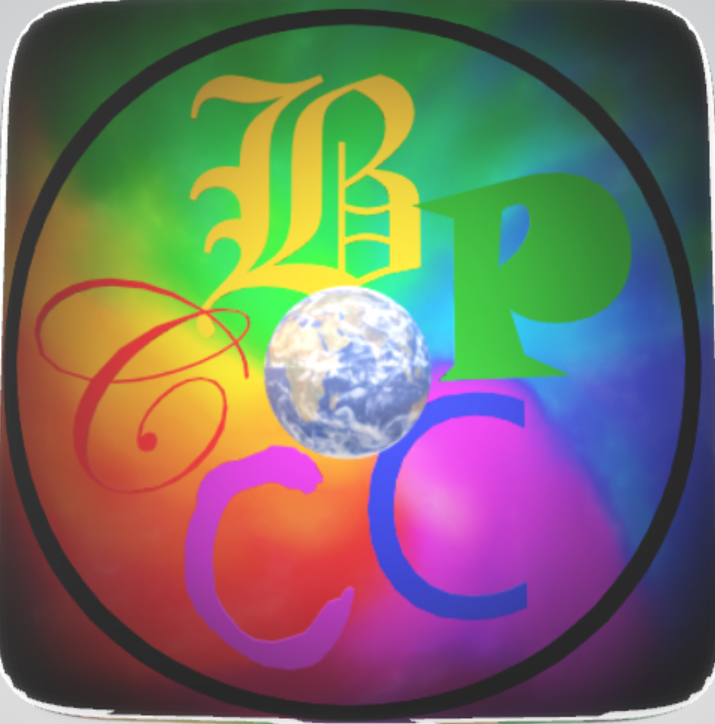

# BPCCC</img> 
This is a site which will has fun activities and interactive user interface 
# [live demo](https://anubhavsingh0708.github.io/BPCCC)
## made using 
* [p5.js](https://p5js.org/)-games work on p5.js javascript library
* [google translate](https://translate.google.com/)translated by google translate
* [google analytics](https://www.google.com/url?sa=t&source=web&rct=j&url=https://analytics.google.com/analytics/web/&ved=2ahUKEwiL_Or24PLuAhVazDgGHZjyBC4QFjAAegQICBAC&usg=AOvVaw095EntAfOjiijSk290zWyQ)we use analytics to monitor visitors
* [github](https://github.com/) this is a open source project hosted on github pages

 ## main elements 
 ### navbar 
 making navbar using html and css 
 ### header 
 making header animating it using css
 ### changing theme colour border color navbar colour
 using javascript ```setTimeout() ``` and ```document.getElementById()```
### google translate 
inserting Google translate using 
```<div id="google_translate_element"></div><script>```
```function googleTranslateElementInit() {```
```new google.translate.TranslateElement({```
```pageLanguage: 'en'}, 'google_translate_element');}</script><script src="//translate.google.com/translate_a/element.js?cb=googleTranslateElementInit"></script>```
### [talk to bpccc](https://editor.p5js.org/anubhav0708/sketches/W0zc96NVw)
### [car race](https://editor.p5js.org/anubhav0708/sketches/Y1DTQrA0i)
### [car race play alone](https://editor.p5js.org/anubhav0708/sketches/aO72H3Y-5)
### PWA using

 * service worker 
 * initialise SW 
 * adjusting viewport to make it available on all devices
 * manifest it to look like native app. 
 ### cards 
 using css 
###license 
[GNU General Public License v3.0](https://github.com/AnubhavSingh0708/BPCCC/blob/main/LICENSE)
